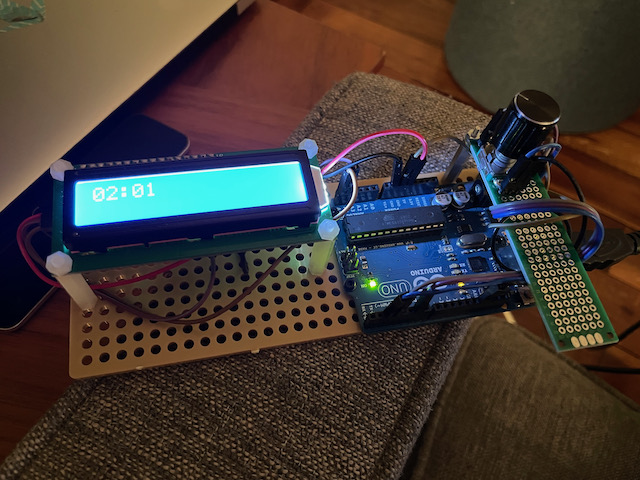

Workout Timer
-------------

A simple workout timer that can run classic workout timers such as count up, count down, 40/20 and tabata styles.
This project is meant as a challenge to solve a few design problems:

- Building intuitive and easy to use menus on a limited space 16x2 LCD screen
- Reliable rotary encoder input with multiple "gestures" such as double click and long press
- Reusable encoder and button debouncer implementation
- Object oriented, clean approach to Arduino implementation, especially for LCD menus
- Battery operated and easily rechargeable device

Current status: Prototype in progress

- [x] Class based object oriented architecture
- [x] Interrupt pin based stable encoder reading 
- [x] Button debouncer with quick feedback (50ms)
- [ ] Simple, object oriented LCD menu system
- [ ] Large digit timer implementation
- [ ] Rechargeable battery integration
- [ ] 3D printed case

